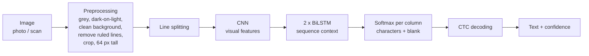

# Handwriting OCR: handwritten text → typed text

A from-scratch **handwritten text recognition (HTR) system** that reads lines of handwritten English
from images and turns them into typed text. It is built with Python and TensorFlow/Keras, uses its
own trained CNN + BiLSTM + CTC model, and includes a local web app.

```text
Input:  [photo or scan of a handwritten line]
Output: It was a splendid interpretation of the
```

* **Reads any sentence.** The model predicts character by character, so it can write sentences
  it has never seen. There is no list of known words.
* **Honest evaluation.** It is tested only on writers and sentences that were never used for training.
* **Robust preprocessing.** It handles phone photos, gray or speckled paper, ruled paper, coloured
  backgrounds and light-on-dark images.
* **Runs offline.** The model is about 4 MB, needs no GPU, and images never leave your computer.
* **Personalisable.** Fine-tune it on your own handwriting with a few dozen lines.

<!-- RESULTS -->
> **Results:** final test-set numbers are added here after training finishes
> (see [Results](#results)).

---

## Contents

1. [What is handwriting OCR?](#1-what-is-handwriting-ocr)
2. [How it works](#2-how-it-works)
3. [Dataset](#3-dataset)
4. [Results](#results)
5. [Project structure](#4-project-structure)
6. [Installation](#5-installation)
7. [Quick start](#6-quick-start)
8. [Training pipeline](#7-training-pipeline)
9. [Predictions and the web app](#8-predictions-and-the-web-app)
10. [Fine-tuning on your own handwriting](#9-fine-tuning-on-your-own-handwriting)
11. [Loading the model in your own code](#10-loading-the-model-in-your-own-code)
12. [Limitations](#limitations)
13. [Future work](#future-work)

---

## 1. What is handwriting OCR?

**OCR** (Optical Character Recognition) turns a picture of text into real text that a computer
can search, copy and edit. **Handwriting** OCR, also called **HTR** (Handwritten Text
Recognition), is the hard version: every person writes differently, letters touch each other,
and the same letter looks different every time.

## 2. How it works



| Part | What it does |
|---|---|
| **Preprocessing** | Makes every image look like the training data: picks the grey channel with the most ink/background contrast, flips light-on-dark images, whitens gray or speckled paper (phone photos), erases straight ruled lines, crops margins and resizes to 64 px height **without distorting** the letters |
| **CNN** (convolutional neural network) | Looks at the pixels and learns visual features: strokes, curves, loops, parts of letters |
| **Bidirectional LSTM** | Reads those features as a sequence, left→right *and* right→left, so each position knows its neighbours (to tell `rn` from `m`) |
| **CTC** (Connectionist Temporal Classification) | Lets the model learn from *image + text* only, without anyone marking where each letter is; at prediction time it merges repeats and removes "blanks": `hh-e-ll-ll-oo` → `hello` |

The model has about 1.1 million weights (4 MB), and lines of any width are supported.

## 3. Dataset

| Item | Details |
|---|---|
| **Name** | IAM Handwriting Database, line level |
| **Source** | [`Teklia/IAM-line`](https://huggingface.co/datasets/Teklia/IAM-line) on Hugging Face, from the [original IAM database](https://fki.tic.heia-fr.ch/databases/iam-handwriting-database) |
| **License** | Listed as MIT on Hugging Face. The original IAM database may be used for **non-commercial research**: fine for learning and portfolios, not for a commercial product |
| **Samples** | 10,373 lines of English handwriting from about 650 writers, each with its exact transcription |
| **Images** | grayscale scans, 128 px tall, one line of handwriting each |
| **Splits** | the official, **writer-independent** split: 6,476 train, 976 validation, 2,915 test. The 6 training lines whose sentence also appears in validation or test were removed, so every test sentence is new |
| **Quality checks** | no missing labels, no corrupted images, no duplicate images (see `results/data_report.json`) |

Labelling style: IAM separates punctuation with spaces (`part . The`, `B B C's`), and the model
learns to write it that way too. A few labels contain small mistakes; real datasets are never
perfect. The dataset (about 265 MB) is downloaded automatically.

## Results

Results are measured on the IAM **test set**: 2,915 lines from writers the model never saw.

| Model | Test CER | Test WER | Training |
|---|---|---|---|
| `handwriting_ocr.keras` | *pending* | *pending* | 20 epochs, laptop CPU |

**CER** (character error rate) is the share of characters that are wrong, missing or extra.
**WER** (word error rate) is the same, counted in whole words. 0 is perfect; lower is better.

During training the model reached a **validation CER of 0.079** (about 92% of characters
correct) after 14 epochs.

Preprocessing robustness, measured on 100–300 lines each:

| Test images | CER without preprocessing step | CER with it |
|---|---|---|
| Clean IAM scans (control) | 0.091 | 0.091 (unchanged) |
| Simulated phone photos (gray, noisy, uneven light) | 0.347 | **0.144** |
| Lines with a ruled line through them | 0.268 | **0.111** |

Saved in `results/`: the loss curve, example predictions (good *and* bad), an error analysis
(most confused characters, errors by line length, confidence vs accuracy) and the metrics as JSON.

### Training environment

The model was trained entirely on an ordinary laptop, **without a GPU**:

| Component | Details |
|---|---|
| Machine | HP EliteBook x360 1030 G3 (laptop) |
| CPU | Intel Core i7-8650U, 4 cores / 8 threads, 1.9 GHz |
| RAM | 16 GB |
| GPU | none used (Intel UHD Graphics 620 is not supported by TensorFlow), CPU only |
| OS | Windows 11 Pro |
| Software | Python 3.13.14, TensorFlow 2.21.0, Keras 3.15.1 |
| Training time per epoch | 16–21 min (average 18.6 min) for 6,476 training lines + validation |
| Total training time | 20 epochs ≈ 6.2 hours (exact time added when training finishes) |
| Data preparation | download ≈ 1–3 min, preprocessing ≈ 2 min (once) |
| Test evaluation | a few minutes for 2,915 lines |
| Peak RAM during training | about 4.3 GB |

On a modern NVIDIA GPU, an epoch would take well under a minute.

## 4. Project structure

```text
handwriting_ocr/
├── data/
│   ├── raw/              downloaded IAM dataset (.parquet)
│   ├── train/ validation/ test/     preprocessed line images + labels.csv
│   ├── my_handwriting/   (you create this) your own lines for fine-tuning
│   └── finetune_demo/    demo data for fine-tuning (created automatically)
├── models/
│   ├── handwriting_ocr.keras              trained model (best epoch)
│   ├── handwriting_ocr_finetuned.keras    fine-tuned on your handwriting (optional)
│   ├── handwriting_ocr_last.keras         latest epoch, used to resume training
│   └── vocab.json                         character ↔ number table (needed by the model)
├── results/              plots, metrics, example predictions, error analysis, logs
├── notebooks/
│   └── handwriting_ocr.ipynb   the whole pipeline, step by step, for beginners
├── src/
│   ├── config.py         all settings and paths in one place
│   ├── download_data.py  download IAM
│   ├── prepare_data.py   check, clean, preprocess and split
│   ├── preprocessing.py  image preprocessing shared by EVERY step (training = prediction)
│   ├── vocab.py          characters ↔ numbers
│   ├── dataset.py        tf.data pipelines: width bucketing, padding, augmentation
│   ├── model.py          CNN + BiLSTM + CTC model, CTC loss, decoding
│   ├── metrics.py        CER, WER, error alignment
│   ├── train.py          training
│   ├── evaluate.py       test-set evaluation + error analysis
│   ├── finetune.py       fine-tune on your own handwriting
│   └── predict.py        read handwriting from your own images (command line)
├── webapp/
│   ├── app.py            local web app: upload an image → see the text
│   └── templates/index.html
├── requirements.txt
└── README.md
```

## 5. Installation

You need **Python 3.10–3.13**; TensorFlow doesn't support Python 3.14 yet. Open a terminal
**in the `handwriting_ocr` folder**.

```bash
python -m venv .venv            # Windows with several Pythons: py -3.13 -m venv .venv
```

Activate it every time you open a new terminal:

| System | Command |
|---|---|
| Windows (PowerShell) | `.venv\Scripts\Activate.ps1` |
| Windows (cmd) | `.venv\Scripts\activate.bat` |
| Linux / macOS | `source .venv/bin/activate` |

If PowerShell refuses to run the script, run this once:
`Set-ExecutionPolicy -Scope CurrentUser RemoteSigned`

```bash
python -m pip install --upgrade pip
pip install -r requirements.txt   # about 1 GB, mostly TensorFlow
```

## 6. Quick start

With a trained model already in `models/`:

```bash
python webapp/app.py                      # web app → open http://127.0.0.1:5000
python src/predict.py my_note.jpg         # or from the command line
```

## 7. Training pipeline

All commands run from the project folder. Every step skips work that's already done.

```bash
python src/download_data.py        # 1. download IAM (≈265 MB, once)
python src/prepare_data.py         # 2. check + preprocess + split (≈2 min, once)
python src/train.py                # 3. train (≈20 min per epoch on a laptop CPU)
python src/evaluate.py             # 4. CER / WER + error analysis on the test set
```

Useful options:

```bash
python src/train.py --epochs 30               # maximum epochs (EarlyStopping may stop sooner)
python src/train.py --resume                  # continue after an interruption
python src/train.py --limit 300 --epochs 2    # 2-minute smoke test
python src/evaluate.py --limit 200            # quick evaluation on 200 test lines
```

**Design choices worth knowing:**

* **No distortion.** Lines are resized to 64 px height, keeping their aspect ratio, so letters are
  never squashed or stretched.
* **Width bucketing.** Lines of similar width are batched together and padded only to the
  widest line in their batch, so nothing is squashed and little computation is wasted on
  padding.
* **Augmentation.** Training images get random slant, stretch, stroke thickness and ink
  intensity, following published IAM experiments.
* **Callbacks.** After every epoch the model reads the validation set and prints
  *Actual vs Predicted*. The best epoch by validation CER is saved, the learning rate is
  halved when progress stalls, and training stops early if nothing improves. Training can be
  resumed after an interruption.
* **No data leakage.** The vocabulary is built from training labels only, and the test set is
  used once, at the end.

**Hardware.** Everything was trained on a laptop CPU (see
[Training environment](#training-environment)). Training uses about 3–5 GB of RAM; lower
`BATCH_SIZE` in `src/config.py` if needed. Keep the computer plugged in and stop it from
sleeping while it trains.

## 8. Predictions and the web app

### Web app

```bash
python webapp/app.py
```

Open **<http://127.0.0.1:5000>**, drag and drop an image and press **Read handwriting**. You get:

* the recognized text, with a **Copy** button
* a confidence score
* each detected line, exactly as the model saw it after preprocessing
* a dropdown to choose a model (e.g. your fine-tuned one)

Everything runs locally. The page automatically uses a newer model file when one is saved.

### Command line

```bash
python src/predict.py path/to/handwriting.png
python src/predict.py a.jpg b.jpg
python src/predict.py one_line.png --single-line
```

```text
Recognized text:
It was a splendid interpretation of the
Confidence: 93% (high)
```

**Confidence** is the model's average certainty for the characters it wrote. Below about 75%,
parts of the text are usually wrong.

**Tips for the best results:** dark pen on white, unlined paper; even light without shadows;
one or a few clearly separated lines per image, cropped to the handwriting.

## 9. Fine-tuning on your own handwriting

Every person writes differently. Fine-tuning continues training the existing model on **your**
handwriting with a small learning rate. About 50–200 lines are enough, because the model
already knows what letters look like.

```text
Existing trained model → load → add your handwriting → continue training (small learning rate) → evaluate → save
```

1. Write some lines, photograph them, and crop **each line** into its own image.
2. Put them in `data/my_handwriting/` with a `labels.csv`:

   ```text
   file,text
   line001.jpg,The weather was beautiful today.
   line002.jpg,I went to the market yesterday
   ```

3. Run `python src/finetune.py`, or `python src/finetune.py --demo` for a demo dataset.

The script prints the CER **before and after** and mixes in original IAM lines so the model
doesn't forget other handwriting. It saves `models/handwriting_ocr_finetuned.keras` and never
overwrites the original model.

## 10. Loading the model in your own code

```python
import sys; sys.path.insert(0, "src")
import keras
from model import ctc_loss, predict_texts
from preprocessing import load_image, to_model_input
from vocab import Vocabulary

model = keras.models.load_model("models/handwriting_ocr.keras",
                                custom_objects={"ctc_loss": ctc_loss})
vocab = Vocabulary.load("models/vocab.json")
text, confidence = predict_texts(model, [to_model_input(load_image("line.png"))], vocab)[0]
```

`custom_objects` is needed because the model uses a custom CTC loss. For prediction only,
`compile=False` also works.

**What is a `.keras` file?** A single zip file with the model's layers, its ~1 million learned
weights and its training settings. **Why no retraining?** Training is the slow part: it finds
good values for those weights. The file stores them, so loading it gives you the trained model
back in a second.

## Limitations

* The model reads **lines**. The built-in line splitter handles a few clearly separated lines,
  not complex page layouts.
* **English handwriting only**, with the characters that appear in IAM (letters, digits, common
  punctuation). Printed or on-screen computer text is out of scope.
* Text tilted more than about 2–3°, strong shadows, and wavy hand-drawn lines touching the
  letters reduce accuracy.
* Handwriting that is very different from IAM's writers needs fine-tuning on samples of it.
* IAM is for non-commercial research use, so the trained model inherits that restriction.

## Future work

| Idea | Why it helps | How |
|---|---|---|
| **Full-page text detection** | Read whole handwritten pages, not only lines | Add a pretrained text detector (e.g. DBNet via ONNX Runtime) before our recognizer: the standard two-stage OCR pipeline (detect → recognize → reading order) used by PaddleOCR and docTR |
| **Searchable PDF output and PDF input** | Turn scanned handwritten documents into PDFs whose text can be selected and searched | Render PDF pages to images, recognize the text, then write an invisible text layer at the detected positions |
| **Language model / LLM post-correction** | A recognition model alone can never be 100% correct on handwriting (see below) | First an offline dictionary/n-gram beam search; then optionally an LLM given the top-N hypotheses, per-character confidence and the image |
| **Better preprocessing** | More robust photos | Deskewing, adaptive (local) background normalisation for shadows, letter-height (x-height) normalisation |

### Why an LLM? A recognition model alone can't be 100% correct

The model reads **pixels, character by character**, without understanding the meaning of the
sentence. In messy handwriting some letters really do look identical (`a`/`o`, `n`/`u`, `l`/`1`,
`O`/`0`, `rn`/`m`), and a single wrong letter makes the whole word wrong. That is why WER is
always much higher than CER.

Example: the image says *"I love my cat"*, but the `c` looks like an `o`.

| Step | Output |
|---|---|
| Recognition model (pixels only) | "I love my **oat**" (80% `o`, 20% `c`) |
| + language model (context) | "I love my **cat**": "my cat" is common English, "my oat" is not |

A language model acts as a "second brain" that checks the model's guesses against real language.

**What research says (it helps, but it is not magic):**

* **Results vary a lot.** A 2025 benchmark of LLM post-correction on handwriting (IAM, RIMES,
  historical sets) found only modest gains, at best about 8% fewer character errors. On noisy
  printed OCR, other studies report 48–58% fewer errors. The benefit depends on the LLM, the
  prompt, and how many errors there are to fix.
* **LLMs can make text worse.** They sometimes "correct" a line into a fluent sentence that
  was never written (hallucination), and such errors are hard to spot because they read well.
* **Alternatives plus confidence help.** Giving the LLM several candidate readings and
  confidence information, and correcting only uncertain lines, works better than handing it a
  single guess.
* **Vision LLMs reading the image directly are very strong.** GPT-4o-mini reached 1.7% CER on
  IAM. But IAM is public and may have been in their training data, and they cost money per
  image, need the internet, and are not private.

**Planned design:**

1. **Offline first:** CTC beam search with a word dictionary / n-gram language model (e.g. Word
   Beam Search), the classic, proven way to lower WER on IAM. It is free, local, and can't
   invent new sentences.
2. **Optional LLM step:** give the LLM the model's **top 5 alternative readings**, mark
   **low-confidence characters**, and optionally add the **image** (vision LLM), so corrections
   stay grounded in what is on the paper.
3. Strict instructions: fix recognition errors only; never rephrase, add or remove words.
4. **Measure** CER/WER with and without each step on the test set, and keep a step only if it
   really helps.

Sources: [Benchmarking LLMs for Handwritten Text Recognition (2025)](https://arxiv.org/pdf/2503.15195) ·
[OCR Post-Correction with LLMs: No Free Lunches (2025)](https://arxiv.org/pdf/2502.01205) ·
[Confidence-Aware Document OCR Error Detection (2024)](https://arxiv.org/html/2409.04117v1) ·
[CNN-BiLSTM on IAM with Word Beam Search + language model (2023)](https://arxiv.org/pdf/2307.00664) ·
[LLM post-correction of British newspapers (Gale, 2024)](https://review.gale.com/2024/09/03/using-large-language-models-for-post-ocr-correction/)
