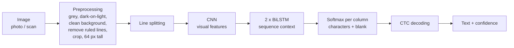

# Handwriting OCR

A from-scratch **handwritten text recognition (HTR) system** that reads lines of handwritten English
from images and turns them into typed text. Handwriting is the hard case of OCR: every person
writes differently, letters touch, and the same letter never looks the same twice. It is built with Python and TensorFlow/Keras, uses its
own trained CNN + BiLSTM + CTC model, and includes a local web app.

```text
Input:  [photo or scan of a handwritten line]
Output: It was a splendid interpretation of the
```

* **Reads any sentence.** The model predicts character by character, so it can write sentences
  it has never seen. There is no list of known words.
* **Honest evaluation.** It is tested only on writers and sentences that were never used for training.
* **Robust preprocessing.** It handles phone photos, gray or speckled paper, ruled paper, coloured
  backgrounds and light-on-dark images.
* **Runs offline.** The model is about 4 MB, needs no GPU, and images never leave your computer.
* **Personalisable.** Fine-tune it on your own handwriting with a few dozen lines.

---

## Contents

- [How it works](#how-it-works)
- [Dataset](#dataset)
- [Results](#results)
- [Project structure](#project-structure)
- [Installation](#installation)
- [Training](#training)
- [Usage](#usage): web app, command line, Python API
- [Fine-tuning on your own handwriting](#fine-tuning-on-your-own-handwriting)
- [Limitations](#limitations)
- [Future work](#future-work)

---

## How it works



| Part | What it does |
|---|---|
| **Preprocessing** | Makes every image look like the training data: picks the grey channel with the most ink/background contrast, flips light-on-dark images, whitens gray or speckled paper (phone photos), erases straight ruled lines, crops margins and resizes to 64 px height **without distorting** the letters |
| **CNN** (convolutional neural network) | Looks at the pixels and learns visual features: strokes, curves, loops, parts of letters |
| **Bidirectional LSTM** | Reads those features as a sequence, left→right *and* right→left, so each position knows its neighbours (to tell `rn` from `m`) |
| **CTC** (Connectionist Temporal Classification) | Lets the model learn from *image + text* only, without anyone marking where each letter is; at prediction time it merges repeats and removes "blanks": `hh-e-ll-ll-oo` → `hello` |

The model has about 1.1 million weights (4 MB), and lines of any width are supported.

## Dataset

| Item | Details |
|---|---|
| **Source** | IAM Handwriting Database, line level: [`Teklia/IAM-line`](https://huggingface.co/datasets/Teklia/IAM-line) on Hugging Face, from the [original IAM database](https://fki.tic.heia-fr.ch/databases/iam-handwriting-database) |
| **License** | Listed as MIT on Hugging Face. The original IAM database may be used for **non-commercial research**: fine for learning and portfolios, not for a commercial product |
| **Samples** | 10,373 lines of English handwriting from about 650 writers, each with its exact transcription |
| **Splits** | the official, **writer-independent** split: 6,476 train, 976 validation, 2,915 test. The 6 training lines whose sentence also appears in validation or test were removed, so every test sentence is new |
| **Quality checks** | no missing labels, no corrupted images, no duplicate images (see `results/data_report.json`) |

IAM labels separate punctuation with spaces (`part . The`), so the model writes it that way too.
The dataset (about 265 MB) is downloaded automatically.

## Results

### Test set performance

Results are measured on the IAM **test set**: 2,915 lines from writers the model never saw.

| Model | Test CER | Test WER | Training |
|---|---|---|---|
| `handwriting_ocr.keras` | *pending* | *pending* | 20 epochs, laptop CPU |

**CER** (character error rate) is the share of characters that are wrong, missing or extra.
**WER** (word error rate) is the same, counted in whole words. 0 is perfect; lower is better.

### Preprocessing robustness

Effect of the preprocessing steps, measured on 100–300 lines each:

| Test images | CER without preprocessing step | CER with it |
|---|---|---|
| Clean IAM scans (control) | 0.091 | 0.091 (unchanged) |
| Simulated phone photos (gray, noisy, uneven light) | 0.347 | **0.144** |
| Lines with a ruled line through them | 0.268 | **0.111** |

Saved in `results/`: the loss curve, example predictions (good *and* bad), an error analysis
(most confused characters, errors by line length, confidence vs accuracy) and the metrics as JSON.

### Training environment

The model was trained entirely on an ordinary laptop, **without a GPU**:

| Component | Details |
|---|---|
| Machine | HP EliteBook x360 1030 G3 (laptop) |
| CPU | Intel Core i7-8650U, 4 cores / 8 threads, 1.9 GHz |
| RAM | 16 GB |
| GPU | none used (Intel UHD Graphics 620 is not supported by TensorFlow), CPU only |
| OS | Windows 11 Pro |
| Software | Python 3.13.14, TensorFlow 2.21.0, Keras 3.15.1 |
| Training time per epoch | 16–21 min (average 18.6 min) for 6,476 training lines + validation |
| Total training time | 20 epochs ≈ 6.2 hours (exact time added when training finishes) |
| Peak RAM during training | about 4.3 GB |

On a modern NVIDIA GPU, an epoch would take well under a minute.

## Project structure

```text
handwriting_ocr/
├── src/             pipeline code: download, prepare, model, train, evaluate, predict, fine-tune
├── webapp/          local Flask web app
├── notebooks/       step-by-step tutorial notebook
├── models/          trained model (handwriting_ocr.keras) + vocab.json
├── results/         metrics, plots, example predictions, error analysis
├── data/            downloaded and preprocessed data (created by the scripts, not in git)
└── requirements.txt
```

## Installation

You need **Python 3.10–3.13**; TensorFlow doesn't support Python 3.14 yet. Open a terminal
**in the `handwriting_ocr` folder**.

```bash
python -m venv .venv            # Windows with several Pythons: py -3.13 -m venv .venv
```

Activate it every time you open a new terminal:

| System | Command |
|---|---|
| Windows (PowerShell) | `.venv\Scripts\Activate.ps1` |
| Windows (cmd) | `.venv\Scripts\activate.bat` |
| Linux / macOS | `source .venv/bin/activate` |

If PowerShell refuses to run the script, run this once:
`Set-ExecutionPolicy -Scope CurrentUser RemoteSigned`

```bash
python -m pip install --upgrade pip
pip install -r requirements.txt   # about 1 GB, mostly TensorFlow
```

## Training

### Commands

All commands run from the project folder. Every step skips work that's already done.

```bash
python src/download_data.py        # 1. download IAM (≈265 MB, once)
python src/prepare_data.py         # 2. check + preprocess + split (≈2 min, once)
python src/train.py                # 3. train (≈20 min per epoch on a laptop CPU)
python src/evaluate.py             # 4. CER / WER + error analysis on the test set
```

Useful options:

```bash
python src/train.py --epochs 30               # maximum epochs (EarlyStopping may stop sooner)
python src/train.py --resume                  # continue after an interruption
python src/train.py --limit 300 --epochs 2    # 2-minute smoke test
python src/evaluate.py --limit 200            # quick evaluation on 200 test lines
```

### Design choices

* **No distortion, little padding.** Lines are resized to 64 px height keeping their aspect
  ratio, and lines of similar width are batched together, so letters are never squashed and
  little computation is wasted on padding.
* **Augmentation.** Training images get random slant, stretch, stroke thickness and ink
  intensity, following published IAM experiments.
* **Callbacks.** After every epoch the model reads the validation set and prints
  *Actual vs Predicted*. The best epoch by validation CER is saved, the learning rate is
  halved when progress stalls, and training stops early if nothing improves. Training can be
  resumed after an interruption.
* **No data leakage.** The vocabulary is built from training labels only, and the test set is
  used once, at the end.

If you run out of memory, lower `BATCH_SIZE` in `src/config.py`. On a laptop, keep it plugged
in and stop it from sleeping while it trains.

## Usage

### Web app

```bash
python webapp/app.py
```

Open **<http://127.0.0.1:5000>**, drag and drop an image and press **Read handwriting**. You get:

* the recognized text, with a **Copy** button
* a confidence score
* each detected line, exactly as the model saw it after preprocessing
* a dropdown to choose a model (e.g. your fine-tuned one)

Everything runs locally. The page automatically uses a newer model file when one is saved.

### Command line

```bash
python src/predict.py path/to/handwriting.png
python src/predict.py a.jpg b.jpg
python src/predict.py one_line.png --single-line
```

```text
Recognized text:
It was a splendid interpretation of the
Confidence: 93% (high)
```

**Confidence** is the model's average certainty for the characters it wrote. Below about 75%,
parts of the text are usually wrong.

**Tips for the best results:** dark pen on white, unlined paper; even light without shadows;
one or a few clearly separated lines per image, cropped to the handwriting.

### Python API

```python
import sys; sys.path.insert(0, "src")
import keras
from model import ctc_loss, predict_texts
from preprocessing import load_image, to_model_input
from vocab import Vocabulary

model = keras.models.load_model("models/handwriting_ocr.keras",
                                custom_objects={"ctc_loss": ctc_loss})
vocab = Vocabulary.load("models/vocab.json")
text, confidence = predict_texts(model, [to_model_input(load_image("line.png"))], vocab)[0]
```

`custom_objects` is needed for the custom CTC loss (`compile=False` also works for prediction).
A `.keras` file stores the layers and all learned weights, so loading it restores the trained
model in seconds, with no retraining.

## Fine-tuning on your own handwriting

Every person writes differently. Fine-tuning continues training the existing model on **your**
handwriting with a small learning rate. About 50–200 lines are enough, because the model
already knows what letters look like.

```text
Existing trained model → load → add your handwriting → continue training (small learning rate) → evaluate → save
```

1. Write some lines, photograph them, and crop **each line** into its own image.
2. Put them in `data/my_handwriting/` with a `labels.csv`:

   ```text
   file,text
   line001.jpg,The weather was beautiful today.
   line002.jpg,I went to the market yesterday
   ```

3. Run `python src/finetune.py`, or `python src/finetune.py --demo` for a demo dataset.

The script prints the CER **before and after** and mixes in original IAM lines so the model
doesn't forget other handwriting. It saves `models/handwriting_ocr_finetuned.keras` and never
overwrites the original model.

## Limitations

* The model reads **lines**. The built-in line splitter handles a few clearly separated lines,
  not complex page layouts.
* **English handwriting only**, with the characters that appear in IAM (letters, digits, common
  punctuation). Printed or on-screen computer text is out of scope.
* Text tilted more than about 2–3°, strong shadows, and wavy hand-drawn lines touching the
  letters reduce accuracy.
* Handwriting that is very different from IAM's writers needs fine-tuning on samples of it.
* IAM is for non-commercial research use, so the trained model inherits that restriction.
  The code itself is MIT-licensed (see [LICENSE](LICENSE)).

## Future work

| Idea | Why it helps | How |
|---|---|---|
| **Full-page text detection** | Read whole handwritten pages, not only lines | Add a pretrained text detector (e.g. DBNet via ONNX Runtime) before our recognizer: the standard two-stage OCR pipeline (detect → recognize → reading order) used by PaddleOCR and docTR |
| **Searchable PDF output and PDF input** | Turn scanned handwritten documents into PDFs whose text can be selected and searched | Render PDF pages to images, recognize the text, then write an invisible text layer at the detected positions |
| **Language model / LLM post-correction** | A recognition model alone can never be 100% correct on handwriting (see below) | First an offline dictionary/n-gram beam search; then optionally an LLM given the top-N hypotheses, per-character confidence and the image |
| **Better preprocessing** | More robust photos | Deskewing, adaptive (local) background normalisation for shadows, letter-height (x-height) normalisation |

### Why use an LLM to correct the recognized text?

A recognition model reads pixels without understanding meaning, so it can never be 100% correct:
some handwritten letters look identical (`a`/`o`, `n`/`u`, `rn`/`m`). It might read *"I love my
cat"* as *"I love my **oat**"*, and a language model fixes that from context. Research shows the
benefit is real but limited. On handwriting, LLM post-correction gave modest gains (about 8% fewer
character errors at best), and LLMs can "correct" text into fluent sentences that were never
written. The plan is therefore: first an offline dictionary/n-gram beam search, then optionally an
LLM given the model's top alternatives, its confidence and the image, keeping each step only if
test CER/WER really improve.
